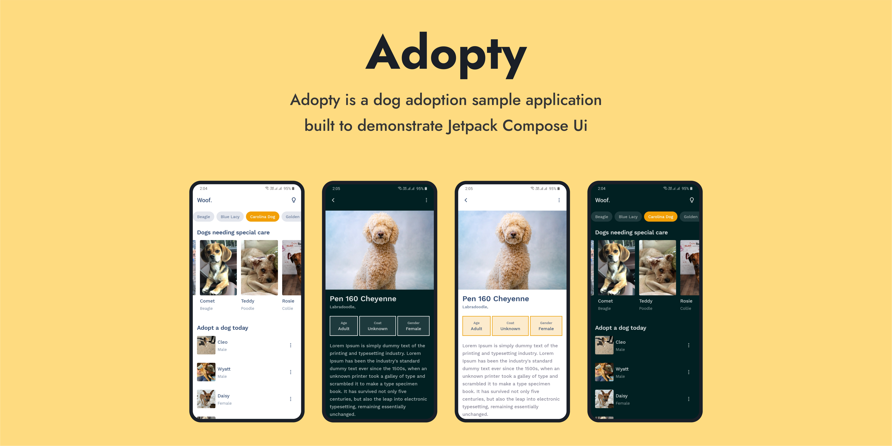

# Adopty


<!--Adopty is a 🐶 dog adoption sample application built to demonstrate Jetpack Compose Ui. Adopty app uses the [Petfinders api](https://www.petfinder.com/developers/v2/docs/) as a data source to show the lists of pets in the application.-->
Adopty is a 🐶 dog adoption sample application built to demonstrate Jetpack Compose Ui. Adopty app uses modern android development tools, design principles and best practices.

## Features
Adopty simply loads data form from the api and shows it in Jetpack compose `LazyList` composable. Adopty app uses the [Petfinders api](https://www.petfinder.com/developers/v2/docs/) as a data source to show the lists of pets in the application./

- It also demonstrates the use of android 12 [SplashScreen](https://developer.android.com/about/versions/12/features/splash-screen) api, including loading data in the background while the SplashScreen is shown on the screen.
- Demonstrates how to implement animations while navigation between screens in Jetpack compose applications using the [accompanist-navigation-animation](https://google.github.io/accompanist/navigation-animation/) library.

### Demo 📱


## Built With 🛠
- [Accompanist](https://google.github.io/accompanist/navigation-animation/) - For implementing animation while navigating between screens in Jetpack Compose app.
- [SplashScreen](https://developer.android.com/about/versions/12/features/splash-screen) - For showing a splash screen.
- [Kotlin](https://kotlinlang.org/) - Official programming language for Android development.
- [Coroutines](https://kotlinlang.org/docs/reference/coroutines-overview.html) - For loading data asynchronously.
- [Flow](https://kotlin.github.io/kotlinx.coroutines/kotlinx-coroutines-core/kotlinx.coroutines.flow/-flow/) - A flow is conceptually a stream of data that can be computed asynchronously.
- [Android Architecture Components](https://developer.android.com/topic/libraries/architecture) - Collection of libraries that help you design robust, testable, and maintainable apps.
- [ViewModel](https://developer.android.com/topic/libraries/architecture/viewmodel) - Stores UI-related data that isn't destroyed on UI changes. 
- [Dagger Hilt](https://dagger.dev/hilt/) - Hilt is a dependency injection library for Android 
- [Retrofit](https://square.github.io/retrofit/) - A type-safe HTTP client for Android and Java.
- [Coil-compose](https://coil-kt.github.io/coil/compose/) - An image loading library for Android backed by Kotlin Coroutines.

## Code Formating ✅
This project uses [Spotless gragle plugin](https://github.com/diffplug/spotless/tree/main/plugin-gradle). Internally spotless uses [ktlint](https://github.com/pinterest/ktlint) to properly format the code. Always use `gradlew app:spotlessApply` before commiting your code.

## Credits
Some of the dog illustrations in this app from Freepik.com 
[Dog vector created by catalyststuff - www.freepik.com](https://www.freepik.com/vectors/dog)

## License
```
MIT License

Copyright (c) 2021 Vivek Singh

Permission is hereby granted, free of charge, to any person obtaining a copy
of this software and associated documentation files (the "Software"), to deal
in the Software without restriction, including without limitation the rights
to use, copy, modify, merge, publish, distribute, sublicense, and/or sell
copies of the Software, and to permit persons to whom the Software is
furnished to do so, subject to the following conditions:

The above copyright notice and this permission notice shall be included in all
copies or substantial portions of the Software.

THE SOFTWARE IS PROVIDED "AS IS", WITHOUT WARRANTY OF ANY KIND, EXPRESS OR
IMPLIED, INCLUDING BUT NOT LIMITED TO THE WARRANTIES OF MERCHANTABILITY,
FITNESS FOR A PARTICULAR PURPOSE AND NONINFRINGEMENT. IN NO EVENT SHALL THE
AUTHORS OR COPYRIGHT HOLDERS BE LIABLE FOR ANY CLAIM, DAMAGES OR OTHER
LIABILITY, WHETHER IN AN ACTION OF CONTRACT, TORT OR OTHERWISE, ARISING FROM,
OUT OF OR IN CONNECTION WITH THE SOFTWARE OR THE USE OR OTHER DEALINGS IN THE
SOFTWARE.
```
